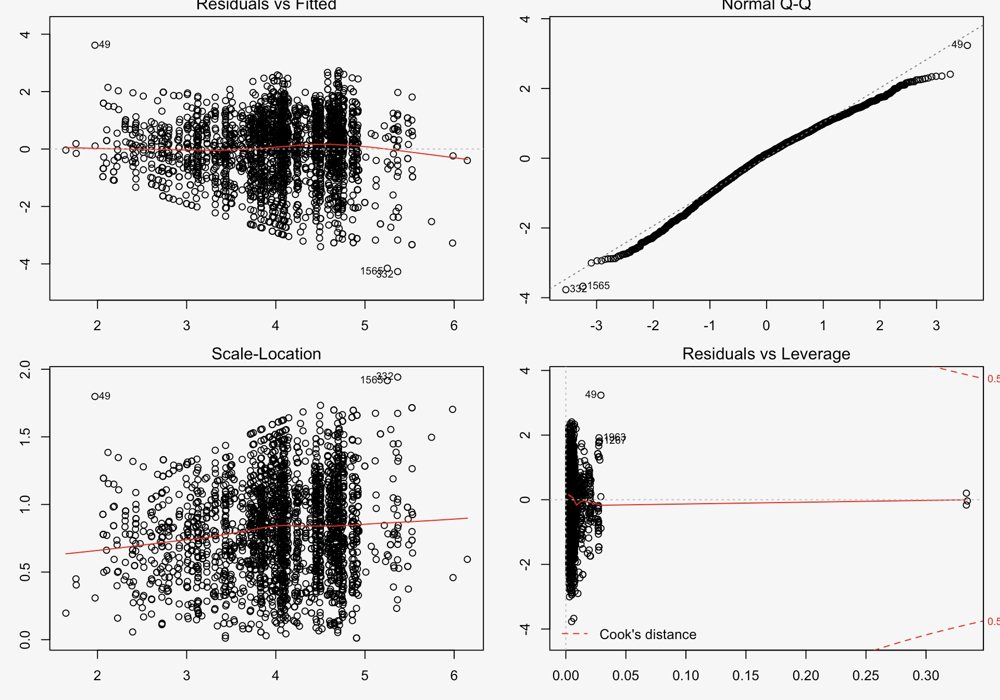
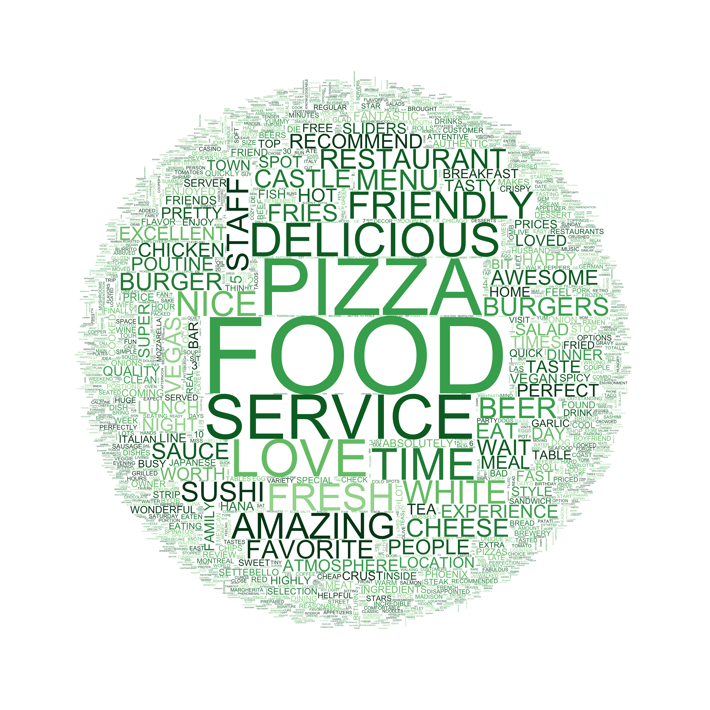

# Screencast
<iframe width="560" height="315" src="http://www.youtube.com/embed/9bZkp7q19f0?rel=0" frameborder="0" allowfullscreen></iframe>

# Overview of the project scope
Nowadays, most customers will search for restaurants on Yelp to decide where to eat for the next meal. The review and rating of a restaurant is of great importance and will help a customer to decide whether this is a good place to eat. Our goal is to find what property makes a restaurant popular and what drives a customer to choose a certain restaurant. Therefore, we choose to explore data of Yelp since it has reviews from customers all over the world.  

In this website, you will see a map of restaurant showing the distribution of restaurants in different categories and some plots to reflect the relationship between customer flow(popularity) and category of a restaurant. Also there are some statistical analysis to help predict customer flow(popularity) of a restaurant. And  We also include some analysis of the review of a restaurant. This might help us to decide what a customer mostly looks for when choosing a restaurant.

# Data
The data used in this project is part of the Yelp Dataset Challenge. The dataset consists of a set of JSON files that include business information, reviews, tips, user information and check-ins. In this project, we have focused on business and reviews.  

# Stastistics analysis
## Analysis of customer flow(popularity) of a restaurant(Regression model)

## Conclusion
After constructing the regression model, we find there is association between number of review and stars, category, location, price range and business hours of a restaurant. We can see from the plots above that the model fits well.

# Visualizations
## Bubble plot showing the distribution of ratings across different categories

## Bubble plot showing the distribution of ratings across different cities

### Conclusion
We can see that most restaurants have main rating level are around 4.0 and 3.5. It seems that the mean rating levels among these categories and cities would be similar.
## Positivity Bar chart

## Positivity Density

### Conclusion
This histogram of positivity scores shows that 1-star reviews have lower positivity compared to 4 or 5-star reviews. 

## Negativity Bar Chart

## Negativity Density

### Conclusion
The histogram of negative reviews looks much different than the positive one. The chart is heavily skewed right. We can see that 5-star reviews aren’t completely positive all the time, though they have lower negativity than the 1 star reviews.

## Word cloud
### 5-star reviews

### 1-star reviews

#### Conclusion
The 5-star reviews contain many instances like “love”, “amazing”, “delicious”, “friendly”. On the contrast, the 1-star reviews use very little positive language, and instead using words like “minutes”, “horrible”, ”worst”, “frozen”, presumably after long and unfortunate waits at the establishment, and the food were not good either. 

## Customized ring plot 
#

### Conclusion
From all the analysis above, we can conclude that Yelp reviews’ star ratings are significantly associated. Yelp reviews with 5-star are generally positive while Yelp reviews with 1-star are generally negative. 

# Results
Through linear regression we find that the passenger flows shown by number of review are affected by stars, cities, categories, prices and their working hours. For business owners, we may suggest that they don’t need to pay attention to the opening hours, although there’re some relationships between business hours and passenger flows. Instead, they should improve their customers exprience to receive feedbacks with higher stars.

## Usefulness of the results
Words that are frequently mentioned in reviews on Yelp might reflect what people most care when going to a restaurant. This is of great imporance as it helps restaurants to put more efforts on certain aspects and improve their business. 